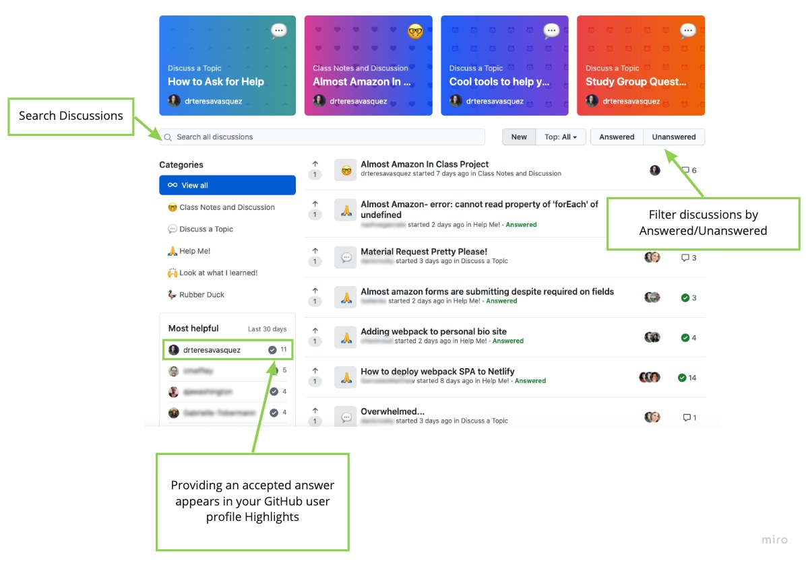

# Student Help Repo
This repo will help instructors and students help each other with code and any other issues related to the coursework.

[Here is a resource](https://guides.github.com/features/mastering-markdown/) to help you learn about markdown to style your code and submissions.

## About the Discussion Board:
Click on the 'Discussion' tab to access the board

Let us know you've read the **[How to Ask for Help](https://github.com/nss-day-cohort-47/C47-Discussions/discussions/1)** discussion and leave a comment that you you understand the process 

**Make sure to search the board before posting a new discussion, so as to not repeat topics**

You will see several categories of discussion. When starting a new discussion, please select the most applicable category based on the descriptions below:

## Class notes and discussion
Supplemental material to topics covered during lectures or anything else in general regarding the curriculum

## Discuss a topic
General topics about code, your bootcamp experience, things we've mentioned in class, cool tech, etc.

## Help me
This is where to go when you have a specific problem and you need a second set of eyes on your code. **Be sure to follow the format outlined [here](https://github.com/nss-day-cohort-47/C47-Discussions/discussions/1)**

If you post a new discussion requesting help...
1. Continue searching for a solution to your issue
1. See if you can help another classmate with an issue they're having
1. Patiently await help for your issue
2. **If you find a solution**, add a comment with your solution and click the check to mark the discussion as answered
2. **If a peer has offered an acceptable solution**, add a comment accepting the solution and click the check to mark the discussion as answered

## Look what I learned
Show off some newfound knowledge or check out what your peers have discovered!

## Rubber Duck
This is a great place to verbalize what your code is or is not doing, as well as your understanding of a particular concept.

## Discussion Board Tips

